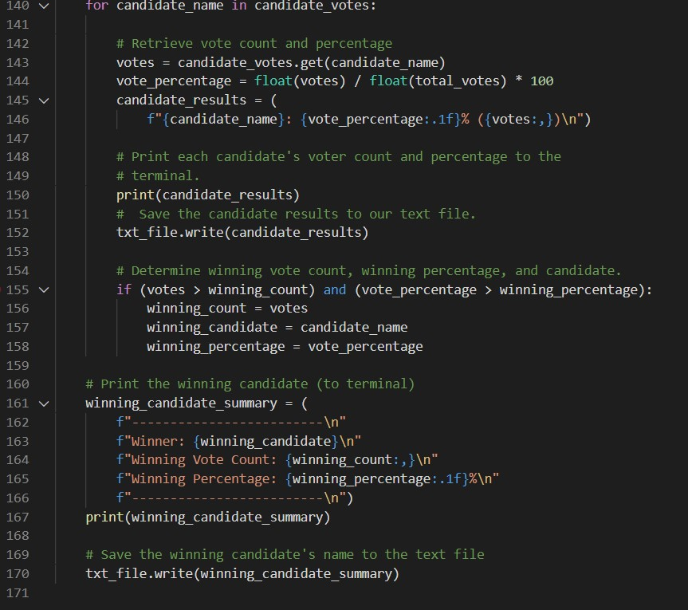

# *Week_3: Election Analysis*

## Project Overview
For this assignment, we were tasked with auditing the outcome of a congressional election near Denver, Colorado.

**Process**
1. Calculate total votes cast. 

2. Compile full list of candidates that received votes
3. Calculate number of votes each candidate received
4. Calculate the percentage of votes each candidate received.

5. Determine the winner of the election based on popular vote.

## Resources
-Data Source: election_results.csv
-Software: Python 3.6.7, Visual Studio Code, 1.38.1

## Summary
The purpose of this election audit was to ensure the accuracy of the election results and determine if a more efficient results calculation process can be developed. The election analysis produced the following results:

## Total Votes: 369,711
### County Votes:
-Jefferson: 10.5% (38,855)
-Denver: 82.8% (306,055)
-Arapahoe: 6.7% (24,801)
*Largest County Turnout: **Denver**

### Candidate Votes:
-Charles Casper Stockham: 23.0% (85,213)
-Diana DeGette: 73.8% (272,892)
-Raymon Anthony Doane: 3.1% (11,606)

### Winner: **Diana DeGette**
-Winning Vote Count: 272,892
-Winning Percentage: 73.8%

# Analysis and recommendation
This code was able to perform the assigned task successfully and with great efficiency. This process should replace any manual counting taking place within your jurisdiction. The code was developed in a way that allows for adaptability and it can be applied in any type of election. 
For example, this code could be adapted to count votes for multiple elections at the same time. Typically, when elections occur, more than one office is available, and voters submit their choices for each office on a single ballot. The CSV file format could remain the same, but with additional columns for each additional office on the ballot. 
Our code would accommodate this change by adjusting all of the candidate variables to be specific to the office in contention. We would have to add additional dictionaries for each office as well, with unique variable names. We would add to the “for row loop” and have the program search each additional row as well as row[2].  

    For row in reader:
	total_votes_office1 = total_votes_office1 + 1
	total_votes_office2 = total_votes_office2 + 1
    total_votes_office3 = total_votes_office3 + 1

    o1_candidate_name = row[2]  
    o2_ candidate_name = row[3]
    o3_ candidate_name = row[4]
	
	And so on and so on for each instance of this variable.

The code can also be adjusted to capture a voter profile for analysis. For example, if the ballots contained information about the voters demographics, we could perform analysis on different voting trends based on age, gender and other factors. The code could be adapted in a way similar to the prior example, adding additional variables to track. The program could then aggregate this data and compare how sectors of the population tend to vote. 

## Recommendation
It is recommended that the state of Colorado continues to employ this firm in an effort to produce reliable election results in an efficient and transparent manner. By allowing this firm to develop the program further to analyze all of Colorado’s elections, the state will do the people of Colorado a great service.
